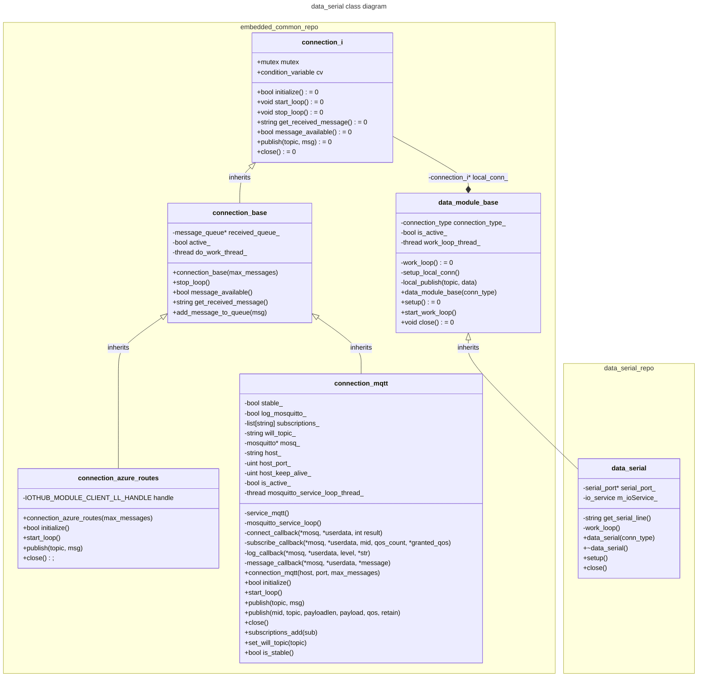

# data_serial
originally part of spbd repo; see that repor for commit history


# todo :
- [x] doxygen
  - [x] remove third_party
  - [x] remove python files
- [ ] prove mqtt behavior
  - [ ] mqtt-listener script
- [ ] sample.json update / automation
  - [ ] unit-test a generated json against sample.json
- [x] relocate common files (install_local_depencencies.sh / third_party)
- [ ] reconnection attempt behavior
- [ ] configuration commands
  - [ ] receive channel

# developer notes
- use `socat` for virtual serial
  - https://stackoverflow.com/questions/52187/virtual-serial-port-for-linux
  - https://stackoverflow.com/questions/66789336/instance-of-serialstream-open-dev-ttyusb0-throws-an-exception-bad-file-desc

- https://www.losant.com/blog/how-to-access-serial-devices-in-docker
```
echo "KERNEL==\"ttyUSB[0-9]*\",MODE=\"0666\"" | sudo tee  /etc/udev/rules.d/99-serial.rules
```